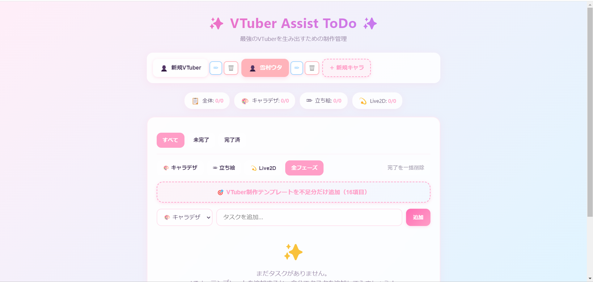
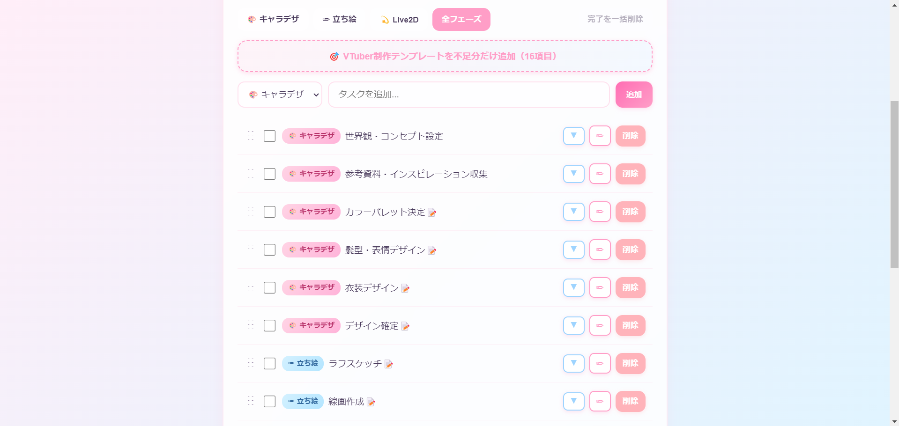
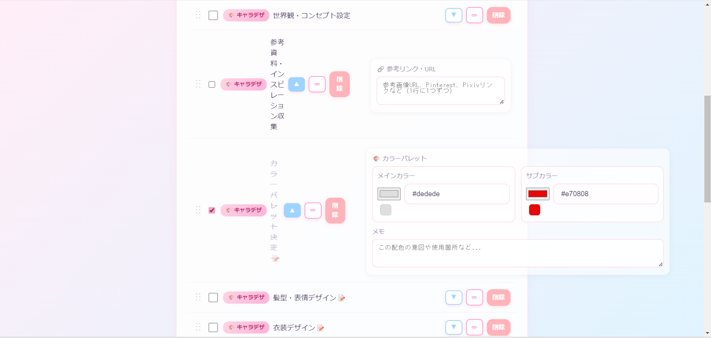

# ✨ VTuber Assist ToDo

**VTuber制作に特化した、次世代タスク管理アプリ**

🔗 **GitHub Pages**: https://higero0324.github.io/todo-list/

---

## 📖 開発の経緯

高専祭での一大プロジェクト「**雪村ウタ**」のLive2D制作を通じて、このアプリは誕生しました。

キャラクターデザインから立ち絵制作、そしてLive2Dモデリングまで、膨大なタスクを抱えながら制作を進める中で、「**VTuber制作に特化したタスク管理ツール**」の必要性を痛感しました。表情差分は何パターン作ったか、物理演算のパラメータ値はどう設定したか、参考資料のURLはどこに保存したか――制作の途中で何度も混乱し、Excel や手書きメモの限界に直面しました。

「もっと直感的に、もっと楽しく、もっとVTuber制作に寄り添ったツールが欲しい！」

そんな思いから生まれたのが、この **VTuber Assist ToDo** です。16種類の専用エディター、ドラッグ&ドロップによる優先順位管理、そして可愛いパステルデザインで、制作過程そのものを楽しい体験に変えることを目指しました。雪村ウタの制作で得た「現場の声」を詰め込んだ、VTuberクリエイターのための、VTuberクリエイターによる、究極のタスク管理アプリです。

## 概要

**VTuber Assist ToDo** は、VTuberの制作工程（キャラデザ → 立ち絵 → Live2D）を**完全管理**するための次世代ToDoリストアプリケーションです。

従来の汎用タスク管理ツールでは対応しきれなかった「**Live2Dの物理演算パラメータ管理**」「**表情差分の進捗チェック**」「**参考資料URLの一元管理**」など、VTuber制作特有のニーズに完全対応。各工程に最適化された**16種類の専用エディター**を搭載し、複数キャラクターの並行制作も楽々サポートします。

プロジェクトの全体像を俯瞰しながら、細部まで緻密に管理できる――それが **VTuber Assist ToDo** の真髄です。制作の「今」を可視化し、次の一手を明確にし、完成への道のりを最短距離で導きます。

もう二度と「あのパラメータ、いくつだったっけ？」と迷うことはありません。あなたの創造力を、**最高の形**で現実にするためのアシスタントがここにあります。

### 主な機能

- 🎨 **3つの制作フェーズ管理**: キャラデザ / 立ち絵 / Live2D
- 👥 **複数キャラクター対応**: キャラごとに独立したToDoリスト
- 📝 **16種類の専用エディター**: 各工程に最適化された入力UI
- ✅ **チェックリスト**: 表情、衣装、パーツ分け、モーションなど
- 🎚️ **物理演算スライダー**: Live2Dの髪揺れ・服揺れを数値で管理
- 🎨 **カラーパレット**: メイン/サブカラーをビジュアルで保存
- 🔗 **参考リンク管理**: PinterestやPixivのURL一括管理
- 📋 **VTuber制作テンプレート**: 16項目のワンクリック追加（重複防止）
- 🔄 **ドラッグ&ドロップ並べ替え**: タスクの優先順位を自由に変更
- ✏️ **インライン編集**: タスク名をダブルクリックで即編集
- 💾 **自動保存**: LocalStorageで進捗を永続化
- 🌸 **激かわデザイン**: パステルカラーとグラデーションで制作を明るい気分で！！

## 📸 スクリーンショット

### メイン画面

*複数キャラクターの進捗を一目で管理。パステルカラーの優しいデザイン*

### テンプレート機能

*VTuber制作に必要な16項目をワンクリックで追加。重複防止機能付き*

### 専用エディター

*工程ごとに最適化された16種類の専用エディター。物理演算スライダーやカラーパレットなど*


## 🚀 デモ

**[👉 今すぐ使ってみる](https://higero0324.github.io/todo-list/)**

ブラウザですぐに使える、VTuber制作特化型タスク管理アプリです。インストール不要、アカウント登録不要で今すぐお試しいただけます！

## 💡 特に工夫した点・オリジナリティ

### 1. VTuber制作に特化した16種類の専用エディター

汎用的なToDoアプリとは異なり、**VTuber制作の各工程に最適化された専用エディター**を実装しました。

- **物理演算スライダー**: Live2Dの髪揺れ・服揺れのパラメータを0〜100のスライダーで直感的に管理
- **カラーパレット**: メインカラー・サブカラーをカラーピッカーで選択し、HEXコードとビジュアルで保存
- **リンク管理**: 参考資料のURLを一括管理し、クリック可能なチップとして表示
- **チェックリスト**: 表情差分、衣装パーツ、モーション一覧など、項目単位での進捗管理

これらは、実際のVTuber制作現場で「こんな機能があったら便利なのに」と感じた経験を形にしたものです。

### 2. 実体験に基づくニッチなニーズへの対応

高専祭での「雪村ウタ」制作時に直面した課題を解決するため、以下の機能を実装：

- **複数キャラクター並行管理**: 1つのアプリで複数のVTuberプロジェクトを管理
- **フェーズ別進捗表示**: キャラデザ・立ち絵・Live2Dの各工程の進捗を可視化
- **重複防止テンプレート**: 16項目のテンプレートを追加する際、既存項目は重複しない仕組み

「作業的に作った感」を排除し、**実際の制作現場の痛みを解決するツール**として設計しました。

### 3. 直感的なUI/UXデザイン

VTuber制作という創造的な作業に寄り添うため、以下のデザイン思想を採用：

- **パステルカラーのグラデーション**: 制作作業を楽しく、ポジティブな気分にするカラーリング
- **ドラッグ&ドロップ**: タスクの優先順位を直感的に変更可能
- **インライン編集**: タスク名をダブルクリックで即座に編集できる操作性
- **アイコンベースの操作**: ✏️ 🗑️ ▼ など、視覚的に分かりやすいアイコン

### 4. 技術的な挑戦

- **@hello-pangea/dnd**: React 18対応のドラッグ&ドロップライブラリを採用し、スムーズな並べ替えを実現
- **LocalStorage**: 複雑なデータ構造（キャラクター別・タスク別の多層構造）を効率的に永続化
- **動的エディター切り替え**: タスクのtypeに応じて、16種類のエディターを動的にレンダリング

## セットアップ

### ローカルで動かしてみる

このアプリをローカル環境で試したい場合の手順です。

#### 1. リポジトリのクローン

```bash
git clone https://github.com/higero0324/todo-list.git
cd todo-list
```

#### 2. 依存関係のインストール

```bash
npm install
```

#### 3. 開発サーバーの起動

```bash
npm run dev
```

ブラウザで http://localhost:5173/ を開くと、アプリが起動します。

---

### このプロジェクトをフォークして使いたい方へ

このリポジトリをフォークして、あなた自身のGitHub Pagesで公開する手順です。

#### 1. GitHubでリポジトリをフォーク

GitHubの画面右上にある「Fork」ボタンをクリックして、自分のアカウントにリポジトリをコピーします。

#### 2. フォークしたリポジトリをクローン

```bash
git clone https://github.com/あなたのユーザー名/todo-list.git
cd todo-list
```

#### 3. 依存関係のインストール

```bash
npm install
```

#### 4. vite.config.js の修正

`vite.config.js` を開き、`base` の値をあなたのリポジトリ名に変更します。

```javascript
export default defineConfig({
  plugins: [react()],
  base: '/todo-list/',  // リポジトリ名が異なる場合は変更してください
})
```

#### 5. GitHub Pagesへデプロイ

```bash
npm run deploy
```

#### 6. GitHub Pagesの設定

- GitHubのリポジトリページで `Settings` → `Pages` に移動
- Source を `gh-pages` ブランチに設定
- 数分後に `https://あなたのユーザー名.github.io/todo-list/` でアクセス可能になります

## 使い方

### 基本操作

#### キャラクター管理

1. **新規キャラクター追加**: 画面右上の「+ キャラクターを追加」ボタンをクリック
2. **キャラクター切り替え**: 各キャラクタータブをクリックして切り替え
3. **名前編集**: タブ横の ✏️ ボタンをクリックしてキャラクター名を編集
4. **削除**: タブ横の 🗑️ ボタンをクリック（※最低1キャラクターは必須です）

#### タスク追加

1. 画面上部の入力欄にタスク名を入力
2. ドロップダウンメニューから制作フェーズを選択（キャラデザ / 立ち絵 / Live2D）
3. 「追加」ボタンをクリック

#### タスク操作

- **完了/未完了の切り替え**: タスク左側のチェックボックスをクリック
- **タスク名の編集**: タスク名をダブルクリック、または右側の ✏️ ボタンをクリック
- **詳細情報の表示**: タスク右側の ▼ ボタンで専用エディターを展開
- **並べ替え**: タスク左側の「⋮⋮」ハンドルをドラッグ&ドロップ
- **削除**: 各タスクの「削除」ボタンをクリック

#### フィルター機能

- **ステータスフィルター**: 「すべて」「未完了」「完了済」から選択
- **フェーズフィルター**: 「全フェーズ」または特定のフェーズを選択
- **一括削除**: 「完了を一括削除」ボタンで完了済みタスクをまとめて削除

### VTuber制作テンプレート

アプリには、VTuber制作に必要な16種類のタスクテンプレートが用意されています。「🎯 VTuber制作テンプレートを不足分だけ追加」ボタンをクリックすると、未追加の項目のみを一括で追加できます（既存項目は重複しません）。

#### テンプレート一覧

**🎨 キャラデザフェーズ（6項目）**
- 世界観・コンセプト設定（メモ型エディター）
- 参考資料・インスピレーション収集（リンク型エディター）
- カラーパレット決定（カラーピッカー型エディター）
- 髪型・表情デザイン（表情チェックリスト型エディター）
- 衣装デザイン（衣装パーツチェックリスト型エディター）
- デザイン確定（汎用チェックリスト型エディター）

**✏️ 立ち絵フェーズ（5項目）**
- ラフスケッチ（チェックリスト+メモ型エディター）
- 線画作成（チェックリスト+メモ型エディター）
- 着色・仕上げ（チェックリスト+メモ型エディター）
- パーツ別レイヤー分け（パーツチェックリスト型エディター）
- 差分表情作成（表情チェックリスト型エディター）

**💫 Live2Dフェーズ（5項目）**
- Cubismセットアップ（セットアップチェックリスト型エディター）
- 顔パーツ設定（顔パラメータチェックリスト型エディター）
- 髪・服の物理演算（物理演算スライダー型エディター）
- 表情モーション作成（モーションチェックリスト型エディター）
- 最終調整・出力（出力チェックリスト型エディター）

### 専用エディターの種類

各タスクには、その工程に最適化された専用エディターが用意されています。タスクの ▼ ボタンをクリックして展開し、詳細情報を入力・管理できます。

#### エディタータイプ一覧

1. **メモ型エディター** 
   - 自由記述が可能なテキストエリア
   - 使用例: コンセプト設定、アイデアメモなど

2. **リンク型エディター**
   - URL一覧を管理
   - 入力したURLは自動的にクリック可能なリンクチップとして表示
   - 使用例: 参考画像、Pinterest、Pixivリンクなど

3. **カラーパレット型エディター**
   - カラーピッカーとHEXコード入力に対応
   - メインカラーとサブカラーを登録可能
   - 補足メモ欄付き
   - 使用例: キャラクターの配色決定

4. **チェックリスト型エディター**
   - 項目の追加・削除・完了チェックが可能
   - 項目名の編集も可能
   - 使用例: 表情パターン、衣装パーツ、モーション一覧など

5. **チェックリスト+メモ型エディター**
   - チェックリストに加えて自由記述メモ欄を併設
   - 使用例: ラフスケッチ、線画、着色などの工程管理

6. **物理演算スライダー型エディター**
   - パラメータごとに0〜100の数値スライダーで管理
   - 使用例: Live2Dの髪揺れ、服揺れなどの物理演算パラメータ

## データの保存について

このアプリは**ブラウザのLocalStorage**を使用してデータを保存します。

- ✅ 入力したデータは自動的に保存されます
- ✅ ブラウザを閉じても、同じブラウザ・同じデバイスであればデータは保持されます
- ⚠️ ブラウザのキャッシュをクリアするとデータが消去されます
- ⚠️ 異なるブラウザやデバイス間でのデータ共有はできません（ローカル保存のため）

重要なデータは定期的にバックアップを取ることをお勧めします。

## 技術スタック

- **フロントエンド**: React 18.3 + Vite 5.4
- **ドラッグ&ドロップ**: @hello-pangea/dnd
- **ユーティリティ**: uuid, date-fns
- **データ永続化**: localStorage
- **スタイル**: カスタムCSS（パステル Kawaii テーマ）

## ファイル構成

```
todo-list/
├── index.html              # アプリのエントリーポイント
├── package.json            # 依存関係とスクリプト
├── vite.config.js          # Vite設定
├── src/
│   ├── main.jsx            # Reactマウントポイント
│   ├── App.jsx             # メインロジック・データ管理
│   ├── index.css           # グローバルスタイル
│   └── components/
│       ├── TodoInput.jsx       # タスク追加UI
│       ├── TodoList.jsx        # タスクリスト表示
│       ├── TodoItem.jsx        # 個別タスク + 専用エディター
│       └── CharacterSelector.jsx # キャラクター管理UI
└── dist/                   # ビルド出力先
```

## データ構造

### 全体構造
```javascript
{
  characters: [
    { id: 'uuid', name: 'キャラ名', color: '#hex' }
  ],
  todosByCharacter: {
    'character-id': [
      {
        id: 'uuid',
        title: 'タスク名',
        stage: 'chara-design' | 'illustration' | 'live2d',
        type: 'concept' | 'references' | 'palette' | 'expressions' | ...,
        completed: boolean,
        createdAt: timestamp,
        data: { /* type別の構造 */ }
      }
    ]
  }
}
```

### type別dataの構造例

```javascript
// メモ型
{ notes: '自由記述' }

// リンク型
{ links: 'URL1\nURL2\nURL3' }

// カラーパレット型
{ mainColor: '#ff9ec7', subColor: '#9ed4ff', notes: '配色メモ' }

// チェックリスト型
{ items: [{ name: '項目名', checked: true }] }

// チェックリスト+メモ型
{ items: [...], notes: '補足メモ' }

// 物理演算型
{ params: [{ name: '髪揺れ', value: 50 }] }
```

## 開発コマンド

```bash
# 依存関係のインストール
npm install

# 開発サーバー起動（ホットリロード有効）
npm run dev

# 本番用ビルド
npm run build

# GitHub Pagesへデプロイ
npm run deploy
```

## 今後の拡張アイデア

- [ ] クラウド同期機能（複数デバイスで進捗共有）
- [ ] エクスポート/インポート（JSON/CSV形式）
- [ ] 制作スケジュール機能（期日設定）
- [ ] 進捗レポート・統計グラフ
- [ ] チーム協力機能（コメント・メンション）
- [ ] モバイルアプリ化（PWA対応）
- [ ] AIアシスタント（制作アドバイス）
- [ ] ファイル添付機能（画像・PSDファイル）

## ライセンス

MIT License - 自由にフォーク、改変、商用利用が可能です。

## コントリビューション

バグ報告、機能提案、プルリクエストを歓迎します！Issue や PR をお気軽にお送りください。

---

**開発期間**: 2025年10月30日 〜 2025年11月15日（約21時間）  
**Made with 💖 for VTuber Creators**
